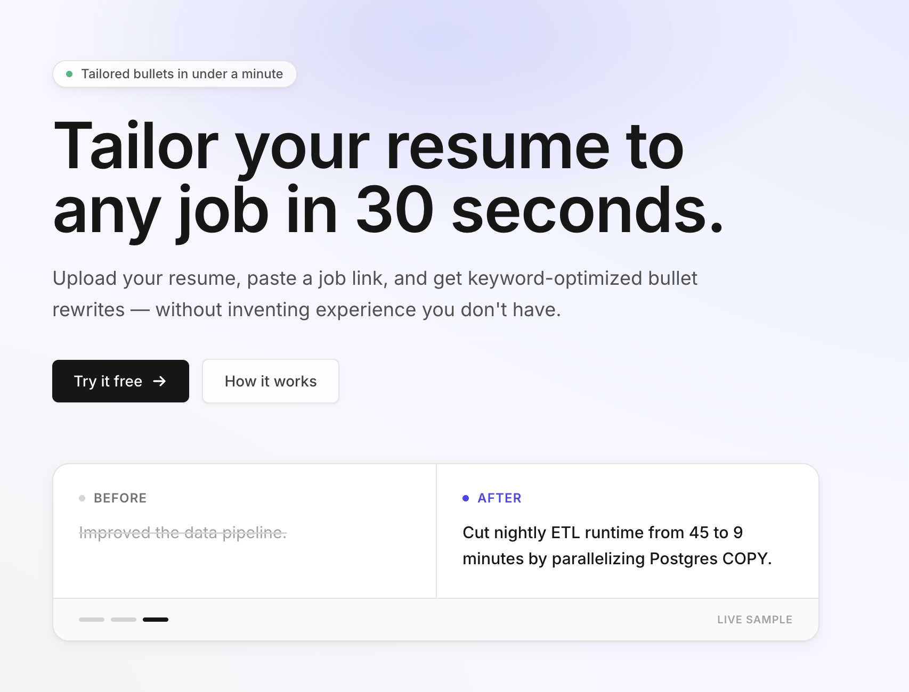
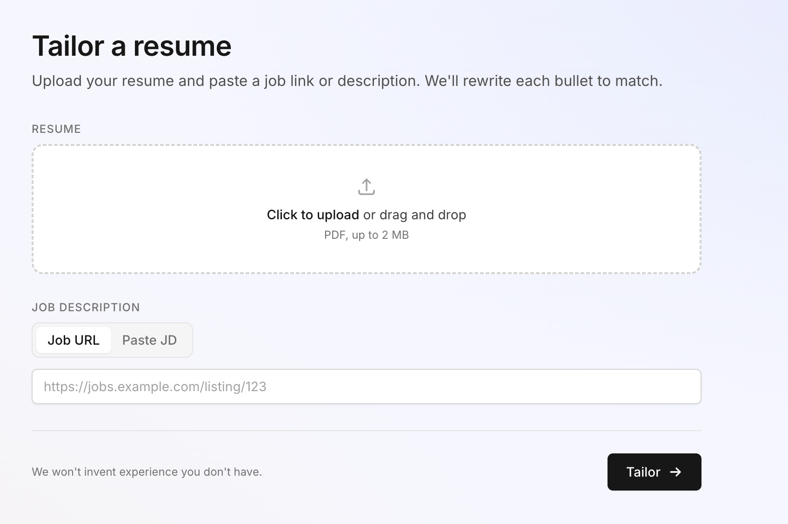
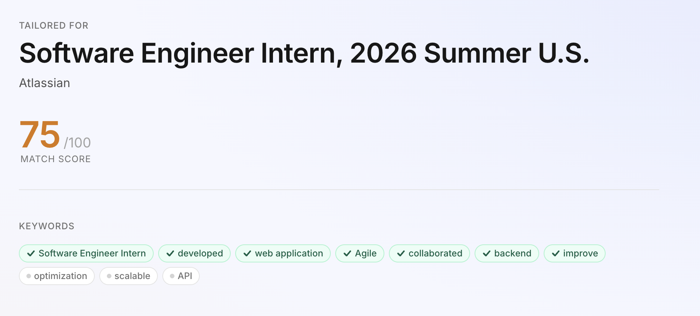
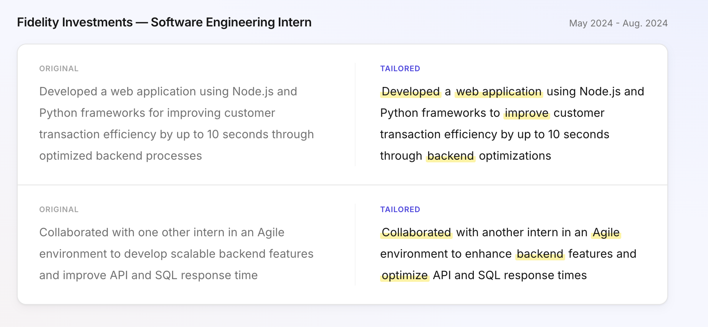

# Resume Tailor

Upload your resume, paste a job link, and get keyword-optimized bullet rewrites in about 30 seconds, without inventing experience you don't have.

The app pulls the job description, compares it against your resume, and rewrites your bullets to match the language and keywords the employer is looking for. You can copy the rewritten bullets straight into your existing resume or export a tailored PDF.



## How it works

**1. Drop your resume and paste a job link.** Resume goes in as a PDF; the JD can be a URL (fetched server-side) or pasted text.



**2. See how well you already match.** The app extracts the keywords the employer cares about and scores your existing resume against them.



**3. Get rewritten bullets, side-by-side.** Each bullet is rewritten to mirror the job's vocabulary, with matched keywords highlighted so you can see exactly what changed.



*Screenshots use a sample resume, not real personal experience.*

## Tech stack

- **Next.js 15** (App Router) + **React 19**
- **Supabase** for auth (Google OAuth + magic link) and storage
- **OpenAI** with structured outputs for the rewriting pipeline
- **@react-pdf/renderer** / **pdfkit** for PDF export
- **Tailwind CSS** + **Zod** + **Vitest**

## Local development

```bash
npm install
cp .env.example .env.local   # fill in Supabase + OpenAI keys
npm run dev
```

Then open http://localhost:3000.

## Scripts

- `npm run dev` — start the dev server
- `npm run build` — production build
- `npm run typecheck` — TypeScript check
- `npm run lint` — Next.js lint
- `npm test` — run the Vitest suite
